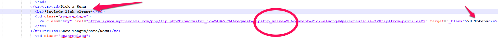
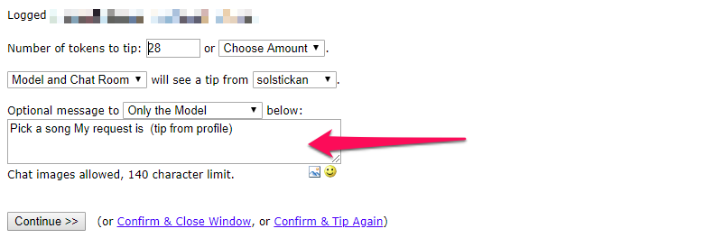
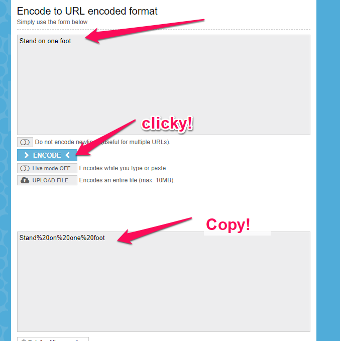

Alrighty! 

First, let me go through some of the most used html tags:

**IMAGES**

```

```

If you want to put an image on the site just use the img-tag. Easy as that ;)

**Links**
```
<a href="https://example.com/mylink.html"> What the page says </a>
```
If we click the _What the page says_ link we will be taken to https://example.com/mylink.html 

**Sections**
There are a few ways to define a section of the page:

```
<div>...</div>
<span>...</span>
``` 
both of these will give you "invisible" boxes to put stuff in where you want it.

```
<br/> is a line break
<p/> is a new paragraph (often 2 line breaks)
```

If you want to learn more about HTML I suggest you go through the w3schools tutorial [here](https://www.w3schools.com/html/default.asp)

# ONWARDS!!

## Changing the tip menus
Start by opening Notepad++, pasting the thing you have in the About me box and saving it somewhere as whateveryouwant.html so you get something that looks like this: 


Now we need to locate the tip menus, scroll down into the file until you find:
```HTML
      <div class="gwabtme maxwidth">
        <span class="neontext">Tip Menus</span>
        <p class="law">ONLINE MENU
```

Now, say we want to change the "Pick a song" option, we find it:
```HTML
<tr><td>Pick a Song
                  <br>*include link please*</td>
                  <td class="spanreplace">
                    <a class="buy" href="https://www.myfreecams.com/php/tip.php?broadcaster_id=24962734&request=tip&tip_value=28&comment=Pick+a+song+My+request+is++%28tip+from+profile%29" target="_blank">28 Tokens</a>
                  </td>
                </tr>
```
and then we pause a bit to explain what's going on here.
First of all. All tags that starts with a slash (/) are end tags, meaning they end a previous tag. All tags should be ended or shit will go bad :D

OK.. 
Let's look at the 
```
<tr>
```
This is a _t_able _r_ow. 

```
<td>
```
is a table cell (no idea why it's not called tc, but we'll have to live with it..

So what we have here is a table row, and a table cell. In the first cell of the table row we write:

```
Pick a song [new line]
*include link please*
```
this is the text that's shown on the profile:


After that we end the table cell with the 
```
</td>
```
and start a new table cell. This is done to align the text and token amounts nicely.

In the new td-cell (which has a class, don't mind that for now) we then put a link:

```HTML
 <a class="buy" href="https://www.myfreecams.com/php/tip.php?broadcaster_id=24962734&request=tip&tip_value=28&comment=Pick+a+song+My+request+is++%28tip+from+profile%29" target="_blank">28 Tokens</a>
```
This link (a stands for anchor I think, but let's call them links) says to go to the link that's specified after the href= parameter.
after the > we see "28 Tokens", which is what is clickable on the profile.

Now say we want to replace Pick a song with "Stand on one foot" and make it cost 31 tokens instead we need to do a few things.
1. Change the actual text on the profile
2. Change the token cost that's shown
3. Change the pre filled tip value that's entered in the tip box that opens up when you click the link
4. Change the pre filled tip note that's entered in the tip note box that opens up when we click.

1,2 and 3 are easy peasy, so let's start with those!



So we get something like this:
```HTML
<tr><td>Stand on one foot</td>
                  <td class="spanreplace">
                    <a class="buy" href="https://www.myfreecams.com/php/tip.php?broadcaster_id=24962734&request=tip&tip_value=31&comment=Pick+a+song+My+request+is++%28tip+from+profile%29" target="_blank">31 Tokens</a>
                  </td>
 ```
  
 Number 4 is a bit more tricky, but it's neat to fix it, otherwise we get this:
 
 wrong.
 
 The tricky part is that it has to be URL encoded, to do this, just go to [this site](https://www.urlencoder.org)
 type in what you want the box to say and paste the thing you get in the second box into the comment= part of the link.
 
 
 so we get this complete link:
 ```HTML
<tr><td>Stand on one foot</td>
                  <td class="spanreplace">
                    <a class="buy" href="https://www.myfreecams.com/php/tip.php?broadcaster_id=24962734&request=tip&tip_value=31&comment=Stand%20on%20one%20foot" target="_blank">31 Tokens</a>
```

Note that the href part is surrounded by quote signs (")


 


